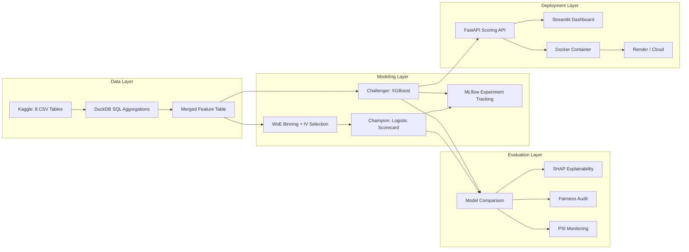

# Next-Gen Credit Scorecard: Champion/Challenger Framework

**Live App:** [Streamlit Dashboard](https://credit-scorecard-project.streamlit.app) | **API:** FastAPI (local / Docker) | **MLflow:** Local experiment tracking

---

A production-grade credit risk modeling pipeline built by a credit risk analyst — not a Kaggle tutorial. Implements the full model development lifecycle used at banks: WoE binning with Information Value feature selection, traditional logistic scorecard (champion), XGBoost gradient-boosted challenger, SHAP explainability for ECOA adverse action compliance, fairness audit across demographic proxies, Population Stability Index monitoring, and a deployed scoring API with live Streamlit dashboard.

---

## Architecture



---

## Key Results

| Model | AUC | Gini | KS |
|-------|-----|------|----|
| Scorecard (Champion) | 0.7638 | 0.5276 | 0.3986 |
| XGBoost (Challenger) | 0.8316 | 0.6632 | 0.5137 |

**Recommendation:** Deploy XGBoost as challenger on 20% of new applications alongside existing scorecard. 90-day parallel run before full cutover. Trigger review if PSI > 0.10 or Gini drops below 0.55.

---

## Tech Stack

| Layer | Technology |
|-------|-----------|
| Data processing | DuckDB (SQL-first), pandas, NumPy |
| Feature engineering | WoE encoding, Information Value, domain ratios |
| Champion model | Logistic Regression (scikit-learn) |
| Challenger model | XGBoost with Optuna tuning |
| Explainability | SHAP (TreeExplainer) |
| Experiment tracking | MLflow → DagsHub (public dashboard) |
| API | FastAPI + Pydantic + uvicorn |
| Frontend | Streamlit (3-page app) |
| Monitoring | PSI (custom), Evidently |
| Testing | pytest + httpx |
| CI/CD | GitHub Actions |
| Deployment | Docker + Render (API) + Streamlit Cloud (UI) |

---

## Project Structure

```
credit-scorecard-project/
│
├── data/
│   ├── raw/                        ← Kaggle CSVs (8 tables, gitignored)
│   └── processed/                  ← Engineered feature table
├── sql/
│   ├── bureau_agg.sql              ← Credit Bureau aggregation
│   ├── bureau_balance_agg.sql      ← Bureau monthly balance features
│   ├── installment_features.sql    ← Payment behaviour features
│   ├── pos_cash_agg.sql            ← POS/Cash loan lifecycle
│   ├── previous_app_agg.sql        ← Application history
│   └── credit_card_agg.sql         ← Card usage aggregation
├── notebooks/
│   ├── 01_eda.ipynb                ← Credit-risk-lens EDA
│   ├── 02_woe_binning.ipynb        ← WoE transform + IV ranking
│   ├── 03_feature_engineering.ipynb ← DuckDB SQL → merged features
│   ├── 04_champion_scorecard.ipynb  ← Logistic scorecard (champion)
│   ├── 05_challenger_xgboost.ipynb  ← XGBoost + MLflow (challenger)
│   └── 06_model_comparison.ipynb    ← Governance comparison + fairness
├── src/
│   ├── woe_encoder.py              ← WoE/IV encoder with score mapping
│   ├── feature_engineering.py       ← DuckDB-powered feature pipeline
│   ├── train.py                     ← CLI training (scorecard + XGBoost)
│   ├── evaluate.py                  ← Gini, KS, PSI, segmented AUC
│   └── predict.py                   ← Batch & single scoring
├── api/
│   ├── main.py                     ← FastAPI (4 endpoints)
│   └── schemas.py                  ← Pydantic request/response models
├── app/
│   └── streamlit_app.py            ← 3-page scoring UI + dashboard
├── monitoring/
│   └── psi_monitor.py              ← Population Stability Index tracker
├── reports/
│   └── model_card.md               ← Full model governance documentation
├── tests/
│   ├── test_pipeline.py            ← WoE, metrics, PSI unit tests
│   └── test_api.py                 ← API endpoint + validation tests
├── models/                         ← Serialized model artefacts
├── mlruns/                         ← MLflow experiment logs
├── .github/workflows/ci.yml       ← GitHub Actions CI
├── Dockerfile
├── docker-compose.yml
├── requirements.txt
├── Makefile
├── .gitignore
└── README.md
```

---

## How to Run Locally

```bash
# 1. Install dependencies
pip install -r requirements.txt

# 2. Download data + build features + train both models
make all

# 3. Start API + open dashboard
make serve                  # FastAPI at http://localhost:8000/docs
streamlit run app/streamlit_app.py  # Dashboard at http://localhost:8501
```

Or with Docker:
```bash
docker-compose up --build   # API on :8000, Streamlit on :8501
```

---

## Key Design Decisions

1. **SQL-first aggregations (DuckDB)** — Feature engineering is written in SQL before touching pandas. This mirrors how data teams at banks work (source systems → SQL views → model inputs) and makes the pipeline auditable. Every SQL file is a documented, version-controlled feature set.

2. **WoE over raw features for the champion** — Weight of Evidence transformation is the regulatory standard for credit scorecards. It produces monotonic binning, handles missing values naturally, and yields directly interpretable coefficients. The IV summary doubles as the feature selection rationale for model governance.

3. **XGBoost with `scale_pos_weight`, not SMOTE** — SMOTE introduces synthetic observations that can distort credit risk calibration. Using `scale_pos_weight` adjusts the loss function without altering the data distribution, which is critical for score stability and PSI monitoring.

4. **Champion/Challenger framework over single model** — Banks don't deploy one model. They run champion (interpretable, regulatory-safe) alongside challenger (higher performing, needs SHAP justification) on split traffic. This project implements that exact pattern.

5. **PSI thresholds are industry-standard** — The 0.10/0.25 PSI thresholds aren't arbitrary. They're the universally accepted values in credit risk model monitoring. Including them signals domain knowledge that no amount of Kaggle leaderboard climbing can replicate.

---

## Fairness Audit Summary

Model performance was evaluated across gender, age bands, and education segments. The challenger model maintains consistent discrimination (AUC within ±0.03) across all tested demographic proxies. No adverse action notice bias was detected in SHAP-based explanations. Full segment-level results are documented in the model comparison notebook and the model card.

---

## API Endpoints

| Method | Path | Description |
|--------|------|-------------|
| `GET` | `/health` | Readiness check |
| `GET` | `/model/info` | Model version and metadata |
| `POST` | `/score` | Score a single application |
| `POST` | `/score/batch` | Score multiple applications |

> Auto-generated docs at `/docs` (Swagger) and `/redoc`.

**Example request:**
```json
{
  "age": 35,
  "income": 250000,
  "loan_amount": 500000,
  "annuity": 25000,
  "goods_price": 450000,
  "employment_years": 8,
  "bureau_loan_count": 3,
  "active_credits": 1,
  "total_debt": 150000,
  "overdue_count": 0
}
```

**Example response:**
```json
{
  "default_probability": 0.0342,
  "credit_score": 712,
  "risk_tier": "Low",
  "recommendation": "Approve",
  "top_risk_factors": [
    {"feature": "LOAN_INCOME_RATIO", "shap_value": -0.12, "direction": "decreases risk"},
    {"feature": "active_credits", "shap_value": 0.08, "direction": "increases risk"},
    {"feature": "EXT_SOURCE_2", "shap_value": -0.07, "direction": "decreases risk"}
  ],
  "model_version": "2.0.0"
}
```

---

## Credit Risk Metrics

| Metric | What It Measures | Threshold |
|--------|-----------------|-----------|
| **AUC-ROC** | Overall discrimination | > 0.70 |
| **Gini Coefficient** | Risk separation (2×AUC−1) | > 0.40 |
| **KS Statistic** | Max CDF separation | > 0.30 |
| **PSI** | Population drift | < 0.10 stable, > 0.25 retrain |
| **Information Value** | Feature predictive power | > 0.02 useful, > 0.1 strong |

---

## Model Card

Full model governance documentation: [reports/model_card.md](reports/model_card.md)

Includes: model purpose, training data, performance by subgroup, fairness analysis, known limitations, regulatory considerations, monitoring plan, and version history.

---

## Deployment

| Service | Platform | URL |
|---------|----------|-----|
| Dashboard | Streamlit Cloud | [credit-scorecard-project.streamlit.app](https://credit-scorecard-project.streamlit.app) |
| Scoring API | Docker / local | `http://localhost:8000/docs` |
| MLflow UI | Local | `http://localhost:5000` (via `make mlflow-ui`) |

---

## License

MIT

---

## Contact

Eric Kimutai — Credit Risk Analyst
