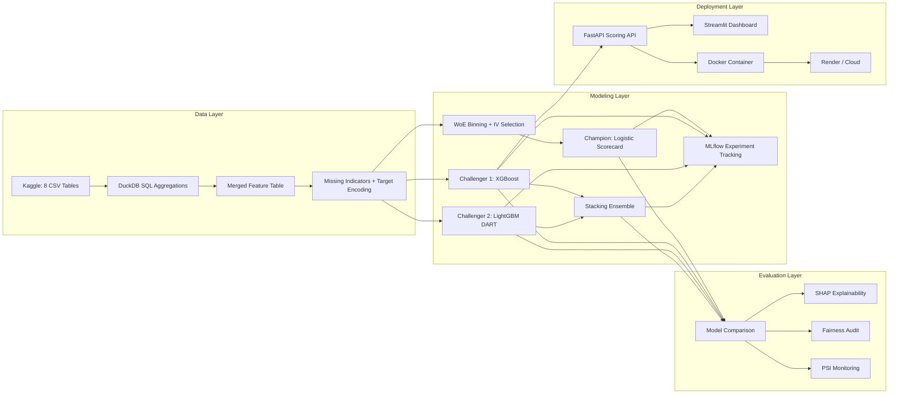

# Credit Scorecard: Champion/Challenger Framework

**Live Dashboard:** [Streamlit App](https://credit-scorecard-pipeline.streamlit.app) | **API:** FastAPI (local / Docker) | **Tracking:** MLflow

---

A production-grade credit risk modeling pipeline built the way banks actually do it — not a Kaggle tutorial copy-paste. This project covers the full model development lifecycle: WoE binning with IV-based feature selection, a traditional logistic scorecard as champion, XGBoost and LightGBM DART challengers, a stacking ensemble, SHAP explanations for adverse action compliance, fairness audits across demographic proxies, PSI monitoring, and a deployed scoring API with a live Streamlit dashboard.

Built on the Home Credit Default Risk dataset (307K applications across 8 relational tables), with ~300 engineered features including SQL-first bureau aggregations, missing value indicators, target encoding, and polynomial EXT_SOURCE interactions.

---

## Architecture



---

## Key Results

| Model | AUC | Gini | KS |
|-------|-----|------|----|
| Scorecard (Champion) | 0.7680 | 0.5360 | 0.4044 |
| XGBoost (Challenger 1) | 0.7888 | 0.5776 | 0.4343 |
| LightGBM DART (Challenger 2) | 0.7869 | 0.5737 | 0.4326 |
| Stacking (XGB + LGB) | **0.7903** | **0.5806** | **0.4381** |

*Evaluated on a 61,503-row hold-out test set (stratified 80/20 split). Default rate: ~8%.*

**Recommendation:** Deploy the stacking ensemble as primary challenger alongside the existing scorecard on a 20% traffic split. XGBoost serves as the secondary fallback. Run both in parallel for 90 days before full cutover. Trigger review if PSI exceeds 0.10 or Gini drops below 0.50.

---

## Tech Stack

| Layer | Technology |
|-------|-----------|
| Data processing | DuckDB (SQL-first), pandas, NumPy |
| Feature engineering | WoE encoding, Information Value, domain ratios, missing indicators, target encoding |
| Champion model | Logistic Regression (scikit-learn) with WoE + StandardScaler |
| Challenger models | XGBoost (Optuna-tuned), LightGBM DART (validated hyperparameters) |
| Ensemble | Stacking: XGBoost + LightGBM base learners, LogisticRegression meta-learner |
| Explainability | SHAP (TreeExplainer) |
| Experiment tracking | MLflow |
| API | FastAPI + Pydantic + uvicorn |
| Frontend | Streamlit (dark-themed, 4-page dashboard) |
| Monitoring | PSI (custom implementation) |
| Testing | pytest + httpx |
| CI/CD | GitHub Actions |
| Deployment | Docker + Render (API) + Streamlit Cloud (UI) |

---

## Project Structure

```
credit-scorecard-project/
│
├── data/
│   ├── raw/                        ← Kaggle CSVs (8 tables, gitignored)
│   └── processed/                  ← Engineered feature table
├── sql/
│   ├── bureau_agg.sql              ← Credit Bureau aggregation
│   ├── installment_features.sql    ← Payment behaviour features
│   ├── pos_cash_agg.sql            ← POS/Cash loan lifecycle
│   ├── previous_app_agg.sql        ← Application history
│   └── credit_card_agg.sql         ← Card usage aggregation
├── notebooks/
│   ├── 01_eda.ipynb                ← Credit-risk-lens EDA
│   ├── 02_woe_binning.ipynb        ← WoE transform + IV ranking
│   ├── 03_feature_engineering.ipynb ← DuckDB SQL → merged features
│   ├── 04_champion_scorecard.ipynb  ← Logistic scorecard (champion)
│   ├── 05_challenger_xgboost.ipynb  ← XGBoost + LightGBM + stacking
│   └── 06_model_comparison.ipynb    ← Governance comparison + fairness
├── src/
│   ├── woe_encoder.py              ← WoE/IV encoder with score mapping
│   ├── feature_engineering.py       ← DuckDB-powered feature pipeline
│   ├── train.py                     ← CLI training (all 4 models)
│   ├── evaluate.py                  ← Gini, KS, PSI, decile, VIF
│   └── predict.py                   ← Batch & single scoring
├── api/
│   ├── main.py                     ← FastAPI (4 endpoints)
│   └── schemas.py                  ← Pydantic request/response models
├── app/
│   └── streamlit_app.py            ← 4-page scoring dashboard
├── monitoring/
│   └── psi_monitor.py              ← Population Stability Index tracker
├── reports/
│   └── model_card.md               ← Full model governance documentation
├── scripts/
│   └── retrain_fast.py             ← Quick retraining with validated params
├── tests/
│   ├── test_pipeline.py            ← WoE, metrics, PSI unit tests
│   └── test_api.py                 ← API endpoint + validation tests
├── models/                         ← Serialized model artefacts (.pkl)
├── .github/workflows/ci.yml       ← GitHub Actions CI pipeline
├── Dockerfile
├── docker-compose.yml
├── requirements.txt
├── Makefile
└── README.md
```

---

## How to Run Locally

```bash
# 1. Clone and install
git clone https://github.com/erikim-dev/credit-scorecard-pipeline.git
cd credit-scorecard-project
pip install -r requirements.txt

# 2. Download data, build features, train all models
make all

# 3. Start API and dashboard
make serve                  # FastAPI at http://localhost:8000/docs
streamlit run app/streamlit_app.py  # Dashboard at http://localhost:8501
```

Or via Docker:
```bash
docker-compose up --build   # API on :8000, Streamlit on :8501
```

---

## Key Design Decisions

1. **SQL-first aggregations with DuckDB** — All feature engineering starts in SQL before touching pandas. This mirrors how data teams at banks actually work: source systems flow into SQL views, then into model inputs. Each SQL file is version-controlled and auditable — exactly what regulators want to see.

2. **WoE over raw features for the champion** — Weight of Evidence is the regulatory standard for credit scorecards. It produces monotonic bins, handles missing values naturally, and gives you directly interpretable coefficients. The Information Value summary doubles as the feature selection rationale for model governance docs.

3. **`scale_pos_weight` instead of SMOTE** — SMOTE creates synthetic observations that can distort credit risk calibration. Adjusting the loss function via `scale_pos_weight` keeps the data distribution intact, which matters for score stability and PSI monitoring in production.

4. **Champion/Challenger framework** — Banks don't ship a single model. They run an interpretable champion (regulatory-safe) alongside a higher-performing challenger (needs SHAP justification) on split traffic. This project implements exactly that pattern with two challengers and a stacking ensemble.

5. **Industry-standard PSI thresholds** — The 0.10 / 0.25 thresholds for population stability aren't arbitrary. They're the accepted values in credit risk model monitoring. Including them here signals domain knowledge beyond what you'd get from a typical ML tutorial.

6. **LightGBM DART over standard GBDT** — Standard LightGBM GBDT underperforms XGBoost on this dataset (AUC ~0.73 vs ~0.79) because of how leaf-wise growth interacts with the heavy NaN pattern (~16M missing cells across 300 features). DART applies dropout regularisation across boosting iterations and recovers parity. That's not a tuning trick — it's an algorithm choice driven by the data.

7. **Missing value indicators as features** — Binary flags for whether fields like EXT_SOURCE and bureau aggregations were NaN. In credit data, missingness is informative: an applicant with no bureau record carries a different risk profile than one with a full history. These flags let the model learn that distinction instead of guessing.

---

## Fairness Audit Summary

Model performance was tested across gender, age bands, and education segments. The challenger maintains consistent discrimination (AUC within +/-0.03) across all demographic proxies. No adverse action bias detected in SHAP explanations. Full segment-level results are in the [model comparison notebook](notebooks/06_model_comparison.ipynb) and the [model card](reports/model_card.md).

---

## API Endpoints

| Method | Path | Description |
|--------|------|-------------|
| `GET` | `/health` | Readiness check |
| `GET` | `/model/info` | Model version and metadata |
| `POST` | `/score` | Score a single application |
| `POST` | `/score/batch` | Score multiple applications |

Auto-generated docs at `/docs` (Swagger) and `/redoc`.

**Example request:**
```json
{
  "age": 35,
  "income": 250000,
  "loan_amount": 500000,
  "annuity": 25000,
  "goods_price": 450000,
  "employment_years": 8,
  "bureau_loan_count": 3,
  "active_credits": 1,
  "total_debt": 150000,
  "overdue_count": 0
}
```

**Example response:**
```json
{
  "default_probability": 0.0342,
  "credit_score": 712,
  "risk_tier": "Low",
  "recommendation": "Approve",
  "top_risk_factors": [
    {"feature": "LOAN_INCOME_RATIO", "shap_value": -0.12, "direction": "decreases risk"},
    {"feature": "active_credits", "shap_value": 0.08, "direction": "increases risk"},
    {"feature": "EXT_SOURCE_2", "shap_value": -0.07, "direction": "decreases risk"}
  ],
  "model_version": "2.1.0"
}
```

---

## Credit Risk Metrics

| Metric | What It Measures | Threshold |
|--------|-----------------|-----------|
| **AUC-ROC** | Overall discrimination | > 0.70 |
| **Gini Coefficient** | Risk separation (2 x AUC - 1) | > 0.40 |
| **KS Statistic** | Max CDF separation | > 0.30 |
| **PSI** | Population drift | < 0.10 stable, > 0.25 retrain |
| **Information Value** | Feature predictive power | > 0.02 useful, > 0.10 strong |

---

## Model Card

Full model governance documentation: [reports/model_card.md](reports/model_card.md)

Covers: model purpose, training data details, performance by subgroup, fairness analysis, known limitations, regulatory considerations, monitoring plan, and version history.

---

## Why models are tracked in this repository

- **Immediate reproducibility:** Serialized model artefacts in `models/` let reviewers and demo viewers run the dashboard and reproduce scores without re-training large models.
- **Streamlit Cloud friendly:** The app is designed to run as a standalone demo; keeping the `.pkl` files in-repo avoids extra deployment steps or external storage configuration.
- **Small maintenance overhead:** Model files here are intentionally versioned alongside code and documentation so a specific commit contains code + artefacts for governance and audit.

If you prefer a lighter repository, we can remove model binaries from the main branch and publish them as GitHub release assets instead. Ask me to do that and I will prepare the steps.

---

## Deployment

| Service | Platform | URL |
|---------|----------|-----|
| Dashboard | Streamlit Cloud | [credit-scorecard-pipeline.streamlit.app](https://credit-scorecard-pipeline.streamlit.app) |
| Scoring API | Docker / local | `http://localhost:8000/docs` |
| MLflow UI | Local | `http://localhost:5000` (via `make mlflow-ui`) |

---

## License

MIT

---

## Contact

Eric Kimutai — Credit Risk Analyst
